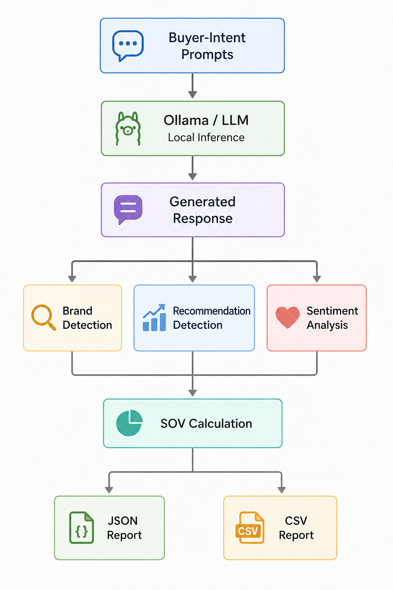

# AgenticSOV

## AI/LLM Brand Visibility & Share-of-Voice Measurement Platform

AgenticSOV is an experimental measurement platform designed to answer a new marketing question:

> **When a potential buyer asks an AI system which product or company they should choose, how often is a specific brand recommended compared with its competitors?**

Traditional SEO tools measure keywords, rankings, backlinks, and search visibility. AgenticSOV explores the emerging layer of AI-generated product discovery by measuring brand mentions, recommendations, sentiment, and recommendation Share-of-Voice across controlled buyer-intent prompts.

---

## The Core Problem

As buyers increasingly use conversational AI to research products and businesses, brands may be recommended, compared, or completely omitted from AI-generated answers.

Traditional SEO analytics cannot directly measure this behavior.

The core problem AgenticSOV addresses is:

> **Businesses lack a simple, measurable way to evaluate how visible and recommendable their brand is inside AI-generated answers compared with competitors.**

---

## The Solution

AgenticSOV takes:

- One target brand
- A set of competitors
- Multiple buyer-intent questions

It then sends those questions to a locally hosted LLM through **Ollama**, analyzes the generated responses, and converts the results into measurable AI visibility signals.

### Core Pipeline

